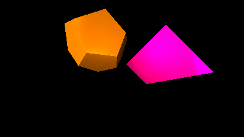
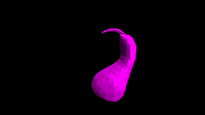
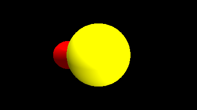
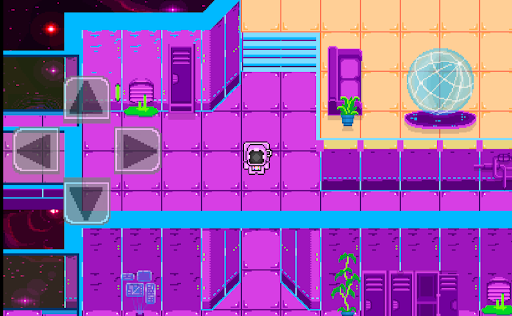

# [Ray-Tracer](https://github.com/Nathan-Hutton/Ray-Tracer)
  

## Replicate the physics of light in a 3D environment to create an image.
### All done in python, no packages. Functionally for multiple objects, smooth shading, spheres, triangle meshes, directional, point, and Phong lighting, shadows, and 3D transformations.
### Granted me significant experience with a large individual project and made me much more familiar with general software design, and most importantly, required learning to problem solve and be self-directed more than any other project. I typically had to extensively study the mathematics behind the ray-tracing algorithm in my own time in order to effectively implement them. It's important to note that at the time of making this project, I had limited math experience, so putting this project together required thorough self-directed studying to achieve.

# [Squibblets](https://github.com/Nathan-Hutton/Squibblets)
 

## Semester long 2D Unity team project made with AGILE.
### Includes leaderboards with a database (no longer supported due to cost), music, artwork, animations, enemy and player movement, UI, sound effects, level transition and level tiling, and math problems geared towards children.
### This project was unique as not only was this comprehensive, semester-long group project, but we came up with our own ideas, and hence, our own problems. Solving these problems required refined critical thinking and collaboration skills, as well as a deep knowledge of how the software itself operated. Creating our own problems to solve required creativity and helped us become independent coders despite the group project setting since this no longer had the typical confines of an academic assignment. Each teammate was able to utilize their unique skills to bring vital aspects of the project to life:
- [Morrigan](https://github.com/CharlesBirdgv) worked on artwork and bringing all teammates contributions together to a cohesive whole. 
- [Taeden](https://github.com/Taedenn) completed nearly all artwork, animations, level design, and the mini-map. 
- [Ben](https://github.com/Groovingo) worked on music and the graphic design of the main menu. 
- I worked on the logic of the game loops, movement, menus, online functonality, and sound effects.